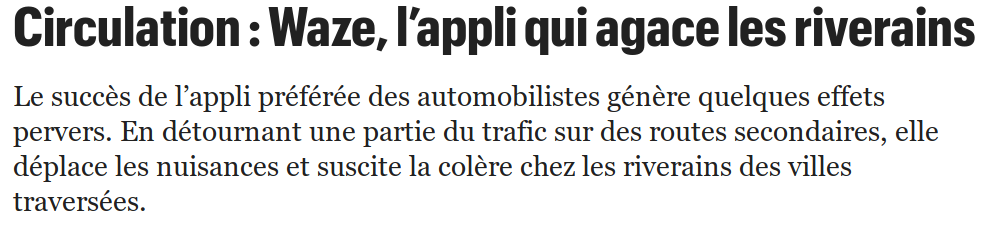
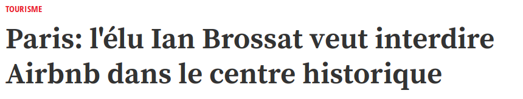

layout: true

`r paste0("
", params$event, " 

")`

---

class: center, middle

Ces slides en ligne : `r paste0("http://datactivist.coop/", params$slug)`

Sources : `r paste0("https://github.com/datactivist/", params$slug)`

Les productions de Datactivist sont librement réutilisables selon les termes de la licence [Creative Commons 4.0 BY-SA](https://creativecommons.org/licenses/by-sa/4.0/legalcode.fr).

 
 

---
## Qui sommes nous ?

   

.center[]

### We .red[open data], we make them .red[useful]

---
## La révolution des données 

  

> En 2020, le volume des données produites en
une seule journée pour la gestion des villes
européennes, sera 4 fois supérieur à celui des
données produites pour toute l’année 2015.

_Source : McKinsey, 2016_

---
## C'est la donnée qui dirige le monde...

.center[]

.center[]

---
## C'est la donnée qui dirige le monde...

.center[]

---
class: inverse, center, middle
# Cinq enjeux stratégiques

---
class: center, middle

## La régulation et la souveraineté

???

Partenariats Waze OM et région Sud
AirBnb
Connaissance du territoire, cartographie (google maps, quelle place pour l'IGN ?)

Code is law ; data is law ?

---
class: center, middle

## La qualité et l'efficience de l'action et du service publics

???

smart city / IoT
ex : eau, éclairage public, mobilité...

---
class: center, middle

## L'irrigation du territoire

### économique, mais aussi sociale, sociétale, environnementale... 

### Pas d'écosystème sans données. 

???

ex : DVF, applis mobilités, canne blanche connectée, 

---
class: center, middle

## Le pilotage de la collectivité

### L'exemple de la commande publique

???

on ne sait pas exactement à combien s'élève la commande publique en France
le pilotage de la commande publique est très difficile
enjeu d'achat au meilleur prix, mais aussi de prévisions, etc.

---
class: center, middle

## La transformation de l'administration

???

- transversalité
- gains d'efficience
- montée en compétence
- agilité
- référentiels

---
## Les conditions de réussite 

- Développer et partager une culture de la donnée

- Poser des principes, une stratégie, des objectifs

- Travailler en transversalité, avec un portage au plus haut niveau

- Travailler étroitement avec ses communautés

---
class: center, middle

## En bref : la donnée n'est PAS une question technique. 

## C'est avant tout une question stratégique !

---
class: inverse, center, middle

# Merci !

Contact : [joel@datactivist.coop](mailto:joel@datactivist.coop)